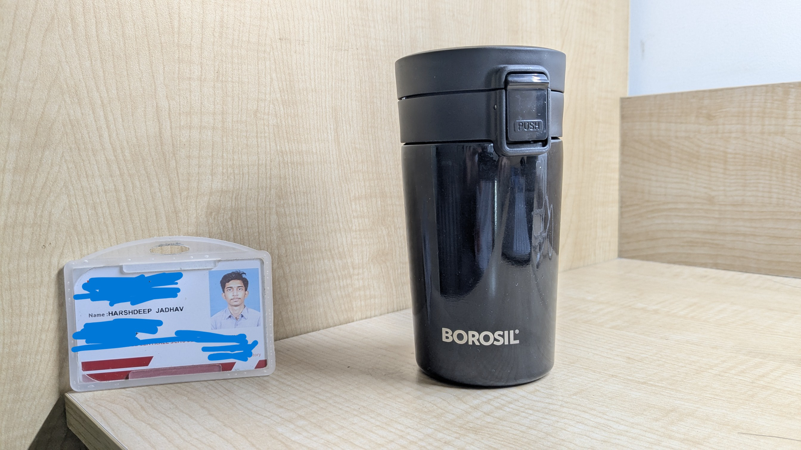
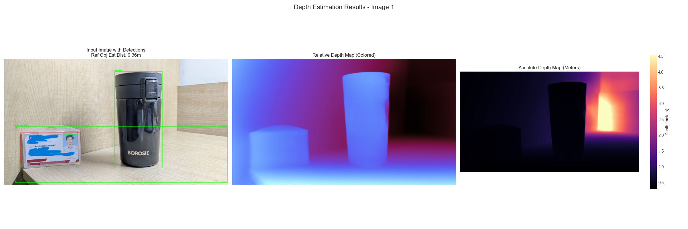
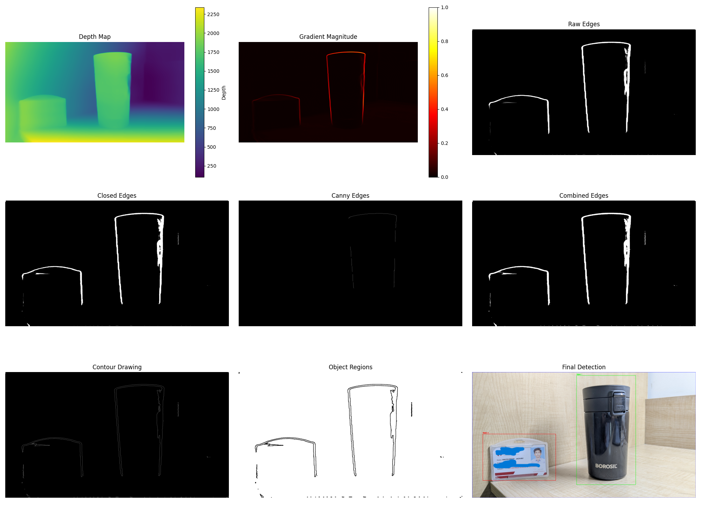
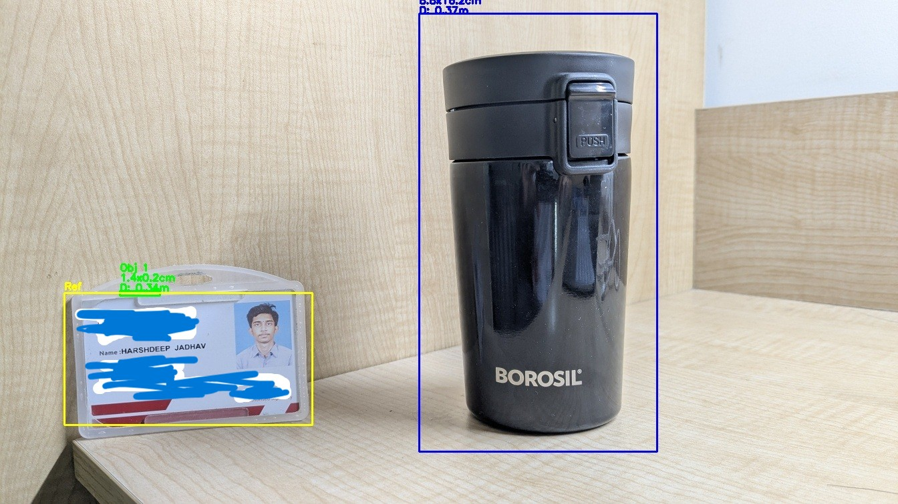

# Object Dimensions Detector using a Single Camera

This project demonstrates a Streamlit application for estimating the real-world dimensions (width, height, depth) and distance of objects from standard 2D images using a single camera (or dual front/side views). It leverages a pre-trained monocular depth estimation model and a user-defined reference object for scale calibration.

## Overview

The application takes one or two images (front and side views), camera parameters (focal length or field of view), and the known dimension of a reference object as input. It then:

1.  **Estimates Depth:** Uses a pre-trained DPT model to generate a relative depth map for each input image.
2.  **Calibrates Scale:** Allows the user to draw a bounding box around a reference object with a known real-world dimension to establish a metric scale.
3.  **Detects Objects:** Automatically detects potential target objects in the image based on depth discontinuities or proximity.
4.  **Estimates Dimensions:** Calculates the width, height, and distance of the detected objects based on their pixel size, estimated depth, and the calibrated scale.
5.  **Combines Views (Optional):** If two views are provided, it combines the width and height from the front view with the depth and height from the side view to provide a 3D dimension estimate.

## Screenshots

### Input and Depth Estimation (Front View)

*Example of an uploaded front view image.*

*The relative depth map estimated by the DPT model for the front view.*

### Object Detection

*Visualization of the object detection process based on the depth map.*

### Measurement Results (Front View)

*The front view image with detected objects and their estimated dimensions overlaid.*

### Example Combined 3D Results

The application displays the estimated dimensions numerically. For example:

| Dimension          | Estimated Value |
| ------------------ | --------------- |
| Width (from Front) | 8.5 cm          |
| Depth (from Side)  | 8.5 cm          |
| Height (Avg)       | 15.5 cm         |
| Distance (Front)   | 0.20 m          |

## Key Features

* **Single/Dual Image Input:** Supports measurement from a single front view or a combination of front and side views for 3D estimation.
* **Reference Object Calibration:** User-friendly interface to select a reference object and input its known dimension.
* **Camera Parameter Flexibility:** Accepts either focal length (in pixels) or horizontal/vertical field of view (in degrees).
* **Automatic Object Detection:** Attempts to automatically identify and measure multiple objects in the scene based on depth information.
* **Streamlit Interface:** Provides an intuitive web-based interface for easy interaction.
* **Visualization:** Overlays bounding boxes and estimated dimensions on the input images.

## Methodology

The core steps involved are:

1.  **User Input:** Uploading images, specifying reference object dimensions, and providing camera parameters.
2.  **Depth Prediction:** Utilizing the `Intel/dpt-hybrid-midas` pre-trained model from Hugging Face Transformers to predict depth maps.
3.  **Scale Calibration:** Calculating a scale factor based on the reference object's known size, its pixel size in the image, its relative depth, and the camera parameters.
4.  **Object Detection:** Employing image processing techniques on the depth map (edge detection, thresholding, connected components analysis) to identify potential objects.
5.  **Dimension Estimation:** Using the calibrated scale, pixel dimensions, and estimated depth to calculate the real-world width, height, and distance of the detected objects.
6.  **Two-View Fusion:** Combining measurements from front and side views (if available) to estimate the 3D dimensions.

## Limitations

* **Reliance on Depth Model Accuracy:** The accuracy of the results is heavily dependent on the quality of the depth maps generated by the pre-trained model.
* **Camera Parameter Sensitivity:** Incorrect focal length or field of view values will lead to inaccurate estimations.
* **Reference Object Requirement:** Accurate selection and known dimensions of a reference object are crucial.
* **Object Detection Challenges:** Depth-based object detection can be unreliable in complex scenes.
* **Two-View Assumptions:** The 3D combination assumes specific object orientations and alignment between views.